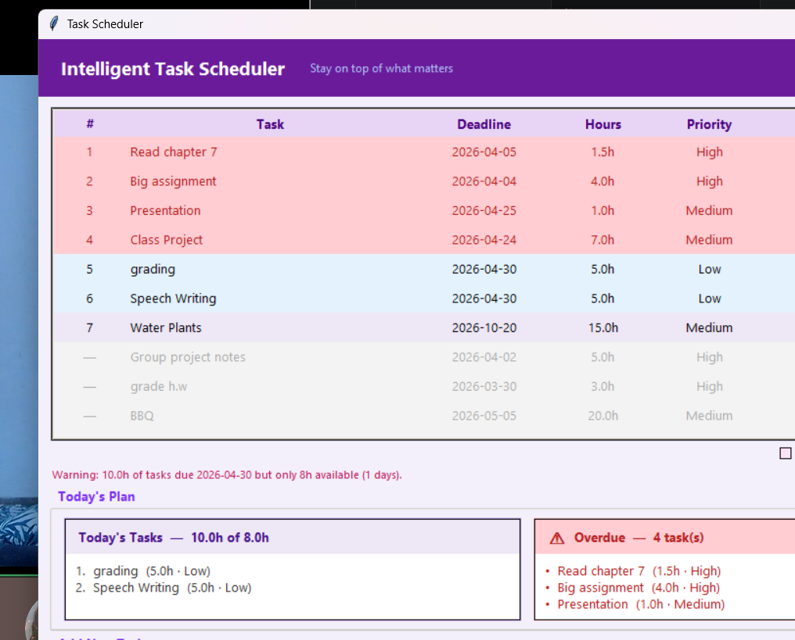
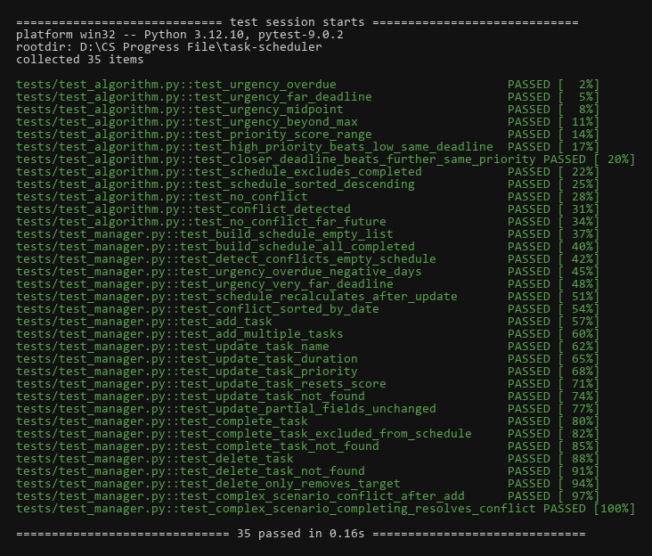

# Intelligent Task Scheduler

A desktop productivity app that ranks your tasks by priority using a custom scoring algorithm. Built with Python and Tkinter.



---

## Features

- **Smart priority scoring**: each task gets a score from 0-100 based on urgency and importance
- **Conflict detection**: warns you when tasks due on the same day add up to more hours than you have available
- **Today's Plan**: builds a focused work list for the day based on what fits in 8 hours
- **Overdue tracking**: overdue tasks get flagged and always show up at the top
- **Saves to disk**: tasks are stored in JSON and reload on every launch
- **Edit tasks**: double-click any task to update its name, deadline, duration, or priority
- **35 passing tests**: pytest suite covering the algorithm and task manager

---

## Screenshots

| Main View | Pytest Suite |
|---|---|
|  |  |

---

## How the Algorithm Works

Each task gets a **priority score** computed as:

```
score = (urgency × 0.6) + (importance × 0.4)
```

**Urgency** (60%) is based on days remaining until the deadline, on a 0-30 day scale:

| Days Remaining | Urgency Score |
|---|---|
| Overdue | 100 |
| 1 day | ~96.7 |
| 5 days | ~83.3 |
| 15 days | ~50.0 |
| 30+ days | 0 |

**Importance** (40%) maps from the user's priority level:

| Priority | Score |
|---|---|
| High | 100 |
| Medium | 66 |
| Low | 33 |

Tasks are sorted highest-to-lowest. Completed tasks are excluded. Full breakdown in [ALGORITHM_EXPLAINED.md](ALGORITHM_EXPLAINED.md).

---

## Project Structure

```
task-scheduler/
├── scheduler/
│   ├── algorithm.py      # priority scoring, schedule builder, conflict detection
│   ├── manager.py        # add, update, complete, delete tasks
│   ├── storage.py        # JSON save/load
│   └── task.py           # task data model
├── gui/
│   ├── app.py            # main window, forms, event handlers
│   └── components/       # reusable UI components
├── tests/
│   ├── test_algorithm.py # tests for scoring and scheduling logic
│   └── test_manager.py   # tests for task manager operations
├── main.py               # entry point
└── requirements.txt
```

---

## Setup

**Requirements:** Python 3.11+

```bash
git clone https://github.com/almas-a11y/task-scheduler.git
cd task-scheduler
pip install -r requirements.txt
```

---

## Run

```bash
python main.py
```

---

## Run Tests

```bash
pytest tests/
```

Expected output: **35 passed**

---

## Tech Stack

| Layer | Technology |
|---|---|
| Language | Python 3.11 |
| GUI | Tkinter (ttk) |
| Storage | JSON |
| Testing | pytest |
| Packaging | PyInstaller |
